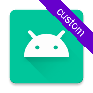
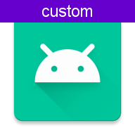
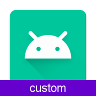
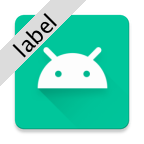
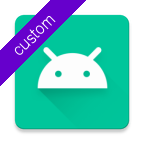
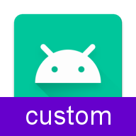

# Easylauncher gradle plugin for Android

Modify the launcher icon of each of your app-variants using simple gradle rules. Add ribbons of any color, overlay your own images, change the colors of the icon, ...

   
 
   

## Usage

### Basic usage

```groovy
// in build.gradle
buildscript {
    repositories {
        mavenCentral()
    }
    dependencies {
        classpath 'com.akaita.android:easylauncher:1.3.1'
    }
}
```

```groovy
// in app/build.gradle
apply plugin: 'com.akaita.android.easylauncher'
```

### Adaptive launcher icons (Android 8.0+)

Additionally to the set up from `Basic usage`, you need to tell the plugin what the name of the foreground layer is:
```groovy
// in app/build.gradle
easylauncher {
    foregroundIconNames "@mipmap/ic_launcher_foreground" // Foreground of adaptive launcher icon
}
```

Warning: please not that `easylauncher` doesn't yet support vector drawables. Please feel free to contribute a PR solving the issue https://github.com/akaita/easylauncher-gradle-plugin/issues/9


### Advanced usage

You can customize the filters applied to each type, flavor and variant of your app.  

Imagin these are the type and flavors of your app:

```groovy
// in app/build.gradle
android {
    buildTypes {
        debug {
            //Debuggable, will get a default ribbon in the launcher icon
        }
        beta {
            //Debuggable, will get a default ribbon in the launcher icon
            debuggable true
        }
        canary {
            //Non-debuggable, will not get any default ribbon
            debuggable false
        }
        release {
            //Non-debuggable, will not get any default ribbon
        }
    }
    productFlavors {
        local {}
        qa {}
        staging {}
        production {}
    }
}
```


You could customize the plugin's behaviour like this: 


```groovy
easylauncher {
    // "manifest application[android:icon]" is automatically added to the list
    iconNames "@mipmap/ic_launcher_foreground" // Traditional launcher icon
    foregroundIconNames "@mipmap/ic_launcher_foreground" // Foreground of adaptive launcher icon
    
    defaultFlavorNaming = true // Use flavor name for default ribbon, instead of the type name
    
    productFlavors {
        local {}
        qa {
            // Add one more filter to all `qa` variants
            filters = redRibbonFilter()
        }
        staging {}
        production {}
    }
    
    buildTypes {
        beta {
            // Add two more filters to all `beta` variants
            filters = [
                    customColorRibbonFilter("#0000FF"),
                    overlayFilter(new File("example-custom/launcherOverlay/beta.png"))
            ]
        }
        canary {
            // Remove ALL filters to `canary` variants
            enable false
        }
        release {}
    }
    
    variants {
        productionDebug {
            // OVERRIDE all previous filters defined for `productionDebug` variant
            filters = orangeRibbonFilter("custom")
        }
    }
}
```


## Available filters

## Grayscale filter

| Command | Result |
| - | - |
| `grayscaleFilter()` |  |


## Overlay filter

| Command | Result |
| - | - |
| `overlayFilter(new File("example-custom/launcherOverlay/beta.png"))` |  |

## Ribbon filters

| Filter | Command | Result |
| - | - | - |
| Gray ribbon | `grayRibbonFilter()` |  |
| Green ribbon | `greenRibbonFilter()` |  |
| Yellow ribbon | `yellowRibbonFilter()` |  |
| Orange ribbon | `orangeRibbonFilter()` |  |
| Red ribbon | `redRibbonFilter()` |  |
| Blue ribbon | `blueRibbonFilter()` |  |

## Advanced Ribbon filter

| Description | Command | Result |
| - | - | - |
| Custom background color  | `customColorRibbonFilter("#6600CC")` |  |
| Custom label | `customColorRibbonFilter("label", "#DCDCDC")` |  |
| Custom text color | `customColorRibbonFilter("label", "#DCDCDC", "#000000")` |  |
| Custom gravity - Top | `customColorRibbonFilter("custom", "#556600CC", "#FFFFFF", "top")` |  |
| Custom gravity - Bottom | `customColorRibbonFilter("custom", "#556600CC", "#FFFFFF", "bottom")` |  |
| Custom gravity - TopLeft | `customColorRibbonFilter("custom", "#556600CC", "#FFFFFF", "topLeft")` |  |
| Custom gravity - TopRight | `customColorRibbonFilter("custom", "#556600CC", "#FFFFFF", "topRight")` |  |
| Custom text size (relative to the icon size) | `customColorRibbonFilter("custom", "#556600CC", "#FFFFFF", "bottom", 0.2)` |  |


## Available options

 - `iconNames`: list of icons to modify (already includes "manifest application[android:icon]")
 - `foregroundIconNames`: list of adaptive icons to modify
 - `defaultFlavorNaming`: use _flavor_ name in default ribbons, instead of using _buildType_
 - `enable`: enable/disable **all** filters for a flavor/type/variant
 - `productFlavors`: define filters for flavors (will be **added** to filters defined for types)
 - `buildTypes`: define filters for types (will be **added** to filter defined for flavors)
 - `variants`: define filters for variants (will **override** any other filters)


## Project Structure

```
plugin/          - Gradle plugin
example-simple/  - Example Android application using easylauncher with the default behaviour
example-custom/  - Example Android application using easylauncher with the custom configuration
buildSrc/        - Helper module to use this plugin in example modules
icons/           - Examples of icons generated by this plugin
```


## Contributing

You can already see my plans for the plugin in the project's Issues section.  

Still, I'm open to feature-requests and suggestions.  
Of course, a PR is the best way to get something you want into the plugin ;)


## Credits

Easylauncher started as an extension of [Fuji Goro's `ribbonizer` plugin](https://github.com/maskarade/gradle-android-ribbonizer-plugin). 
As it evolved, I decided it changed enough to be worth releasing as a separate plugin.
